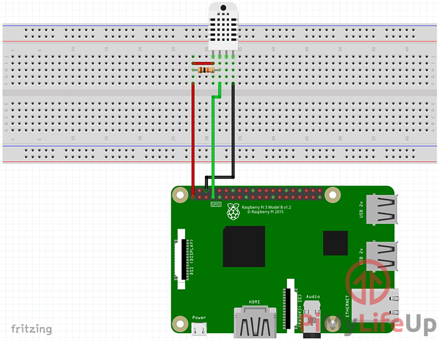
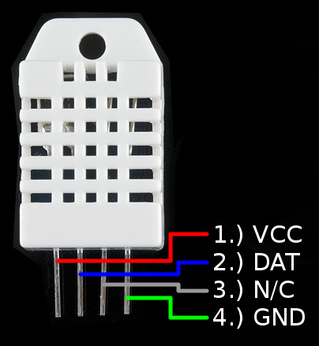

# Veggerby Greenhouse

https://azure.microsoft.com/da-dk/pricing/calculator/

https://pinout.xyz/

https://raspberrypi.stackexchange.com/questions/66395/how-to-use-a-gpio-pin-after-i-put-on-a-hat

https://www.raspberrypi.org/documentation/hardware/raspberrypi/spi/README.md

## Develop VS Code over SSH

https://www.hanselman.com/blog/VisualStudioCodeRemoteDevelopmentOverSSHToARaspberryPiIsButter.aspx

## GPIO Zero

https://gpiozero.readthedocs.io/en/stable/index.html

https://www.raspberrypi.org/documentation/usage/gpio/python/README.md

## LED
https://thepihut.com/blogs/raspberry-pi-tutorials/27968772-turning-on-an-led-with-your-raspberry-pis-gpio-pins


## SenseHAT

https://pythonhosted.org/sense-hat/

https://pinout.xyz/pinout/sense_hat

## Camera

https://raspberrypi.dk/produkt/zerocam-nightvision/

https://stamm-wilbrandt.de/en/Raspberry_camera.html
https://github.com/Hermann-SW/Raspberry_v1_camera_global_external_shutter
https://github.com/Hermann-SW2/userland/tree/master/host_applications/linux/apps/hello_pi/i420toh264#i420toh264
https://github.com/Hermann-SW/fork-raspiraw

https://www.raspberrypi.org/documentation/usage/camera/raspicam/timelapse.md

## Temperature/humidity sensor

### References

https://let-elektronik.dk/shop/1520-vejr/10167-humidity-and-temperature-sensor---rht03/

https://learn.sparkfun.com/tutorials/rht03-dht22-humidity-and-temperature-sensor-hookup-guide

https://howtomechatronics.com/tutorials/arduino/dht11-dht22-sensors-temperature-and-humidity-tutorial-using-arduino/

https://cdn.sparkfun.com/datasheets/Sensors/Weather/RHT03.pdf

https://pimylifeup.com/raspberry-pi-humidity-sensor-dht22/



### Pinout

The pins of the RHT03 (DHT22) are labeled in the image below.



| Pin | RHT03 (DHT22)| Notes                             |
| --- | ------------ | --------------------------------- |
| 1   | VCC          | Input Voltage between 3.3-6V DC   |
| 2   | DAT          | Data Output                       |
| 3   | N/C          | Not Connected                     |
| 4   | GND          | Ground                            |

### Install Adafruit_DHT library:

https://github.com/adafruit/Adafruit_Python_DHT

pip install Adafruit_DHT

## Raspberry PI Zero

https://www.raspberrypi.org/documentation/configuration/wireless/wireless-cli.md

## PIJuice Zero

https://uk.pi-supply.com/products/pijuice-zero

https://learn.pi-supply.com/make/pijuice-zero-quick-start-guide/

https://github.com/PiSupply/PiJuice/tree/master/Software

https://github.com/PiSupply/PiJuice/tree/master/Software#i2c-command-api

https://github.com/PiSupply/PiJuice/blob/master/Hardware/README.md#pinout

### Install CLI
sudo apt-get install pijuice-base

### Run CLI

pijuice_cli

## Python3/pip

https://learn.sparkfun.com/tutorials/python-programming-tutorial-getting-started-with-the-raspberry-pi/configure-your-pi

https://realpython.com/python-logging/

### Upgrade Pip
pip install --upgrade pip

## Azure EventHub

https://pypi.org/project/azure-eventhub/

https://docs.microsoft.com/en-us/azure/event-hubs/event-hubs-python-get-started-send

### Install Python library
sudo pip install azure-eventhub

## Azure Functions

https://docs.microsoft.com/en-us/azure/azure-functions/functions-dotnet-dependency-injection

https://docs.microsoft.com/en-us/azure/azure-functions/functions-dotnet-class-library#environment-variables

https://docs.microsoft.com/en-us/azure/azure-functions/functions-run-local?tabs=linux%2Ccsharp%2Cbash

Add the IP to the database access

### Azure Functions Tools

brew link --overwrite azure-functions-core-tools@3

Can also be installed via npm

## EF Core

### Update tools

dotnet tool update --global dotnet-ef

### Add initial migration

## Crontab

https://crontab.guru/every-10-minutes

## Sparkfun Soil Moisture sensor

https://let-elektronik.dk/shop/1500-biometri--gas/13637--soil-moisture-sensor-with-screw-terminals/

https://learn.sparkfun.com/tutorials/soil-moisture-sensor-hookup-guide/all

https://www.instructables.com/id/Soil-Moisture-Sensor-Raspberry-Pi/

https://github.com/jerbly/tutorials/blob/master/moisture/moist_final.py

https://computers.tutsplus.com/tutorials/build-a-raspberry-pi-moisture-sensor-to-monitor-your-plants--mac-52875

https://thepihut.com/blogs/raspberry-pi-tutorials/raspberry-pi-plant-pot-moisture-sensor-with-email-notification-tutorial

https://www.sparkfun.com/products/13637

https://www.instructables.com/id/Soil-Moisture-Sensor-Raspberry-Pi/

## Adafruit RGB Negative 16x2 LCD

https://www.adafruit.com/product/1110

https://learn.adafruit.com/adafruit-16x2-character-lcd-plus-keypad-for-raspberry-pi

## MCP3008

https://github.com/adafruit/Adafruit_Python_MCP3008/blob/master/examples/simpletest.py

Deprecated

https://learn.adafruit.com/raspberry-pi-analog-to-digital-converters/mcp3008

Future

https://learn.adafruit.com/circuitpython-basics-i2c-and-spi/spi-devices

https://github.com/adafruit/Adafruit_CircuitPython_MCP3xxx/

```import time
import busio
import digitalio
import board
import adafruit_mcp3xxx.mcp3008 as MCP
from adafruit_mcp3xxx.analog_in import AnalogIn

# create the spi bus
spi = busio.SPI(clock=board.SCK, MISO=board.MISO, MOSI=board.MOSI)

# create the cs (chip select)
cs = digitalio.DigitalInOut(board.D5)

# create the mcp object
mcp = MCP.MCP3008(spi, cs)

print('Reading MCP3008 values, press Ctrl-C to quit...')
# Print nice channel column headers.
print('| {0:>4} | {1:>4} | {2:>4} | {3:>4} | {4:>4} | {5:>4} | {6:>4} | {7:>4} |'.format(*range(8)))
print('-' * 57)

while True:
    # Read all the ADC channel values in a list.
    values = [0]*8
    for i in range(8):
        # The read_adc function will get the value of the specified channel (0-7).
        values[i] = AnalogIn(mcp, i).value
    # Print the ADC values.
    print('| {0:>4} | {1:>4} | {2:>4} | {3:>4} | {4:>4} | {5:>4} | {6:>4} | {7:>4} |'.format(*values))
    # Pause for half a second.
    time.sleep(0.5)

# create an analog input channel on pin 0
#chan = AnalogIn(mcp, MCP.P7)

#print('Raw ADC Value: ', chan.value)
#print('ADC Voltage: ' + str(chan.voltage) + 'V')```

## ASP.NET MVC Core + React

https://docs.microsoft.com/en-us/aspnet/core/client-side/spa/react?view=aspnetcore-3.1&tabs=netcore-cli